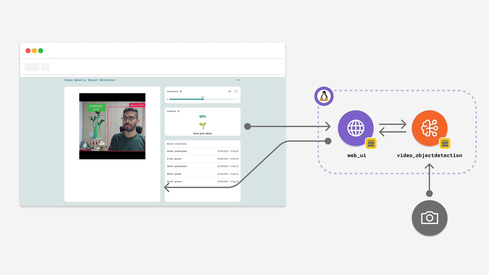

# Detect Objects on Camera

The **Detect Objects on Camera** example lets you detect objects on a live feed and visualize bounding boxes around the detections in real-time.

By default the video source is a **USB camera** (the original behavior). Optionally,
it can instead pull its feed from an **Android phone running an IP-camera app**
(e.g. "IP Webcam" by Pavel Khlebovich) over the network, for testing without a USB
camera attached.



This example uses a pre-trained model to detect objects on a live video feed. The
workflow involves continuously getting frames from the camera, processing them
through an AI model using the `video_objectdetection` Brick, and displaying the
bounding boxes around detections. The App is managed from an interactive web
interface.

## Camera Source

Controlled by `CAMERA_SOURCE` — switching between USB, IP camera, and video file is
purely a `CAMERA_SOURCE` change, no `app.yaml` edits needed. In every mode the app
itself opens the camera (`V4LCamera`, `IPCamera`, or the local `FileCamera`) and
hands it to `VideoObjectDetection`, which captures from it and forwards frames to
the detection runner; the runner never needs direct device access, so `app.yaml`
declares `devices: [remote_camera_0]` on the `video_object_detection` brick
unconditionally.

| Var | Default | Meaning |
|-----|---------|---------|
| `CAMERA_SOURCE` | `file` | `usb` for a physically-connected USB camera, `ip` for an Android IP-camera stream, or `file` to loop a local video file instead of a live feed |
| `CAMERA_DUAL_LENS_STACKED` | `false` | Set to `true` when the camera is a 360° dual-lens rig that stacks the rear-camera image on top and the front-camera image on the bottom of a single frame. Flips the LED Matrix position display's row mapping to match (see LED Matrix Person Position Display below); leave `false` for a normal single-lens camera. |

### USB (default)

**Note:** This mode must be run in **Network Mode** in the Arduino App Lab, since it
requires a USB-C hub and a USB camera.

| Var | Default | Meaning |
|-----|---------|---------|
| `USB_CAMERA_DEVICE` | _(from `VIDEO_DEVICE`, else `0`)_ | USB camera index or `/dev/videoX` path. `arduino-app-cli` auto-detects a connected camera into `VIDEO_DEVICE`; only set this to override that. |

Requires the camera to expose a `/dev/v4l/by-id/` udev entry (standard for real USB
webcams). On hardware with no physical camera attached at all, this fails at
startup with `CameraOpenError` rather than the CLI's pre-flight check — expected,
since `app.yaml` no longer declares a hard physical-camera requirement.

### IP camera (optional)

1. On the Android phone, install an IP-camera app (e.g. "IP Webcam") and start its
   server. Make sure the phone is on the **same network** as the board.
2. Note the stream URL it shows, typically `http://<phone-ip>:8080/video`.
3. Set `CAMERA_SOURCE=ip`, `IP_CAMERA_URL` (and `IP_CAMERA_USERNAME` /
   `IP_CAMERA_PASSWORD` if the app's stream is password-protected) as below.

| Var | Default | Meaning |
|-----|---------|---------|
| `IP_CAMERA_URL` | `http://192.168.18.65:8080/video` | IP camera stream URL (RTSP/HTTP/HTTPS) |
| `IP_CAMERA_USERNAME` | _(none)_ | Optional stream auth username |
| `IP_CAMERA_PASSWORD` | _(none)_ | Optional stream auth password |
| `IP_CAMERA_FPS` | `10` | Frames per second to pull from the stream |

### Video file (optional)

Loops a local video file as the detection input — useful for testing/demoing
without any camera attached. The file must be reachable inside the app container;
place it somewhere under the app folder (e.g. `media/`, next to `python/`), which
is bind-mounted to `/app`, and point `VIDEO_FILE_PATH` at its in-container path.

A sample clip is bundled at `media/sample.mp4` (stock footage from Pexels, free
license) — set `VIDEO_FILE_PATH=/app/media/sample.mp4` to try this mode out of
the box.

| Var | Default | Meaning |
|-----|---------|---------|
| `VIDEO_FILE_PATH` | `/app/media/sample.mp4` | Path to the video file, as seen inside the container |
| `VIDEO_FILE_LOOP` | `true` | Rewind and replay the file once it ends, so detection keeps running continuously |
| `VIDEO_FILE_FPS` | `10` | Frames per second to read from the file |

## Brick Used

The example uses the following Bricks:

- `web_ui`: Brick to create a web interface to display the classification results and model controls.
- `video_objectdetection`: Brick to classify objects within a live video feed from a camera.
- `cloud_llm`: Brick to connect to Cloud LLMs for dynamically generating 10x6 LED matrix icon silhouettes when new object classes are detected.

## Qonclave Hub Event Forwarding

When a `person` is detected with confidence above a configurable threshold, this app
POSTs the detection frame + event metadata to the Qonclave hub's `/edge/event`
endpoint (see `hub/README.md`), so the hub can run its own heavier verification. A
hysteresis window prevents re-sending on every frame while a person stays in view.

Configurable via environment variables (set as Brick Configuration / env vars in
App Lab):

| Var | Default | Meaning |
|-----|---------|---------|
| `DEVICE_ID` | `unoq-01` | Identifier sent as `device_id` in the event |
| `HUB_MDNS_NAME` | `qonclave-hub.local` | mDNS ZeroConf hostname for automatic Hub LAN discovery |
| `HUB_IP` | `192.168.50.207` | Hub's fallback IP address if mDNS fails |
| `HUB_PORT` | `8000` | Hub's HTTP port |
| `PERSON_CONFIDENCE_THRESHOLD` | `0.7` | Minimum person-detection confidence (0-1) to trigger an event |
| `HUB_EVENT_HYSTERESIS_SEC` | `10` | Minimum seconds between two hub events |
| `HUB_EVENT_TIMEOUT_SEC` | `5` | HTTP request timeout when posting to the hub |

## Person Tracking

Each detection frame from `video_objectdetection` is independent — it has no notion of
"this is the same person as last frame." To support future features like rotating the
camera to follow a person, `python/person_tracker.py` assigns persistent track IDs to
detected people across frames using a lightweight greedy nearest-centroid tracker (no
extra dependencies), and estimates a coarse 8-way movement direction (`left`, `right`,
`up`, `down`, and diagonals, or `stationary`) from recent centroid history.

Each frame's person tracks are logged (`qonclave.edge` logger, debug level) and drive
the LED Matrix position display described below — direction itself doesn't yet drive
camera rotation, that's the next step.

Configurable via environment variables:

| Var | Default | Meaning |
|-----|---------|---------|
| `PERSON_TRACK_MAX_DISAPPEARED` | `10` | Frames a person can go unmatched before their track is dropped |
| `PERSON_TRACK_MAX_DISTANCE_PX` | `150` | Max centroid movement (px) between frames to still count as the same person |
| `PERSON_TRACK_DIRECTION_HISTORY` | `5` | Frames of centroid history used to smooth the direction estimate |
| `PERSON_TRACK_MIN_MOVEMENT_PX` | `10` | Minimum net movement (px) over the smoothing window before direction is reported as `stationary` |

## LED Matrix Person Position Display

While a person is being tracked, the onboard **12x8 LED Matrix** shows roughly where
they are in the camera frame instead of the usual object-class icon: `python/led_display.py`
projects the tracked person's centroid (in the camera frame's pixel space, via
`camera.resolution`) outward from the frame's center onto the grid's **outer ring**
(row 0, row 7, and the left/right columns of the rows in between) — a ray-cast
projection, so the lit position sweeps smoothly all the way around the ring as the
person moves anywhere in frame, and never encroaches on the interior. Of the currently
tracked people, the most-established track (the one tracked over the most frames) is
shown, so a briefly-flickering new detection doesn't steal the display from an existing
one. There's no separate arrow or icon for direction — the dot's position shifting
around the ring frame-to-frame is the direction signal.

Constraining the position indicator to the ring frees up the interior **6x10 region**
for a **person emotion** indicator, shown at the same time: `emotion_bitmap()` in
`led_display.py` currently renders a hardcoded smiley placeholder, but is structured so
an LLM-generated emotion bitmap (mirroring the existing per-object icon pipeline that
queries the Qonclave Hub's `/edge/icon` endpoint) can be dropped in later without
changing the call site.

As soon as no person is tracked, the display reverts to the normal object icon (or
clear) behavior.

### 360° dual-lens cameras

Some 360° cameras deliver a single frame with the **rear-camera image stacked on top**
and the **front-camera image on the bottom**. For that layout, the raw top/bottom pixel
position is the opposite of the LED matrix's natural top/bottom rows: a person seen by
the front camera (bottom half of the frame) should light up the **top** rows, and a
person seen by the rear camera (top half of the frame) should light up the **bottom**
rows. Setting `CAMERA_DUAL_LENS_STACKED=true` (see Camera Source above) makes
`main.py` vertically flip the centroid's Y coordinate before mapping it to the grid, so
the displayed position matches which physical camera actually saw the person. Leave it
`false` for a normal single-lens camera, where the frame's top/bottom already matches
the matrix's top/bottom rows.

This reuses the existing `set_custom_led_array` Bridge call — no `sketch/sketch.ino` change
was needed.

## Hardware and Software Requirements

### Hardware

- [Arduino® UNO Q](https://store.arduino.cc/products/uno-q) or Arduino VENTUNO Q
- USB camera (x1) — _or_ an Android phone running an IP-camera app on the same network (see Camera Source above)
- USB-C® hub adapter with external power (x1) _(only for UNO Q, only in USB camera mode)_
- A power supply (5 V, 3 A) for the USB hub (e.g. a phone charger) _(only for UNO Q, only in USB camera mode)_
- Potentiometer connected to analog pin A0 (optional, for physical threshold control)
- Personal computer with internet access

### Software

- Arduino App Lab

## How to Use the Example

1. USB mode (default): connect the USB-C hub to the UNO Q and the USB camera, then
   attach the external power supply.
   
   IP camera mode: start the IP-camera app on the phone and set `CAMERA_SOURCE=ip` /
   `IP_CAMERA_URL` as described in Camera Source above.
2. (Optional) Connect a potentiometer wiper to analog pin A0 on the UNO Q for physical confidence threshold control.
3. Run the App.
   
4. The App should open automatically in the web browser. You can open it manually via `<board-name>.local:7000`.
5. Position any object in front of the camera and watch as the App detects and recognizes them.
6. Observe the UNO Q's onboard **12x8 LED Matrix**: it will dynamically render custom hardware-aligned icons corresponding to detected objects!
7. Rotate the potentiometer knob to dynamically adjust the AI detection confidence threshold in real-time.

Try with one of the following objects for a special reaction (both on the Web UI and the LED Matrix):

- Cat
- Cell phone
- Clock
- Cup
- Dog
- Potted plant
- Person


## How it Works

This example hosts a Web UI where we can see the video input from the camera connected via USB. The video stream is then processed using the `video_objectdetection` Brick. When an object is detected, it is logged along with the confidence score (e.g. 95% potted plant).

Here is a brief explanation of the full-stack application:

### 🔧 Backend (main.py)

- Initializes the app Bricks:
  - **WebUI** (`ui = WebUI()`): channel to push messages to the frontend.
  - **VideoObjectDetection** (`detection_stream = VideoObjectDetection()`): runs object detection on the video stream.
  - **CloudLLM** (`llm = CloudLLM()`): AI text completion engine to synthesize custom LED matrix icons in real-time.

- **Single Source of Truth & AI Icon Caching (`icons_cache.json`)**:
  - Maintains a local JSON file (`icons_cache.json`) pre-populated with redesigned default bitmaps (`person`, `cat`, `dog`, `cell phone`, `clock`, `cup`, `potted plant`, `clear`, `green`), all centered in a **10x6 grid** with an empty 1-pixel outer border of OFF LEDs (`0`).
  - Acts as the Single Source of Truth: on startup, Python synchronizes the entire cache to web clients via WebSocket (`request_icons` ↔ `sync_icons`), eliminating hardcoded arrays from the frontend JavaScript.
  - When a newly detected object class is encountered, a background thread prompts `CloudLLM` to generate a centered **10x6 binary grid** silhouette. A 1-pixel empty border of OFF LEDs is appended on all four sides to form a clean, bordered 12x8 grid, which is saved to `icons_cache.json` and immediately broadcast to all connected web browsers via `sync_icons`.
  - Flattens the 12x8 grid into a 96-character bitstring and transmits it to the microcontroller firmware via `Bridge.call("set_custom_led_array", bitstring)`.
  - Pushes dynamic bitmap data and an `ai_generated` boolean flag to the frontend via `ui.send_message("led_status", ...)`.

- **Person Position + Emotion on LED Matrix (`led_display.py`)**:
  - While `person_tracker.py` has an active person track, `led_display.person_display_bitmap()` projects that track's centroid (via `camera.resolution`, flipped first when `CAMERA_DUAL_LENS_STACKED=true`) onto the grid's outer ring and composes it with a center smiley placeholder, instead of the usual object icon, and reverts to icon rendering once no person is tracked.

- Wires detection events to actions using callbacks:
  - `on_detect_all(send_detections_to_ui)`: sends `{ content, confidence, timestamp }` via `ui.send_message("detection", ...)` and triggers icon rendering (or the person-position display, when applicable).

---

### ⚡ Microcontroller & Hardware Bridge (sketch/sketch.ino)

- **Dynamic 10x6 Bordered LED Matrix Icon Display (Single Source of Truth)**:
  - Uses the `Arduino_LED_Matrix` library configured with a **13-column hardware stride buffer** (`byte frame[8][13]`) required by the UNO Q and Zephyr OS architecture.
  - Registers a custom `set_custom_led_array` Bridge callback that receives 96-character bitstrings from Python, parses them into 0/1 integer grids, and renders dynamic icons in real-time on the physical UNO Q LED matrix.
  - Eliminated over 75 lines of hardcoded icon arrays and lookup blocks from C++; the microcontroller now only keeps `icon_clear` for boot-up initialization while Python streams all icon bitmaps dynamically from `icons_cache.json`.
- **Physical Potentiometer Threshold Control**:
  - Continuously samples analog pin A0 (`analogRead(A0)`) with debounce and noise filtering.
  - When the knob is adjusted, it transmits percentage changes over the Bridge via `Bridge.call("on_knob_change", str(percentage))` to dynamically adjust the AI detection confidence threshold in Python and update the Web UI slider simultaneously.

---

### 💻 Frontend (index.html + app.js)

- **Single Source of Truth Virtual Matrix & AI Badging**
  - Receives the icon cache dynamically from Python via WebSocket (`sync_icons`), requiring zero hardcoded bitmap arrays in `app.js`.
  - Renders physical LED states on the browser `#virtualMatrixGrid`.
  - When an AI-generated icon is displayed, dots glow in magenta/purple (`#e879f9`) and `#ledArrayText` displays a glowing gradient `✨ AI ICON` badge. When standard icons are displayed, dots glow in gold (`#ffb700`).

- **Video feed & Controls**
  - iframe auto-retries /embed until the camera stream is available
  - Slider, numeric input, and reset button adjust threshold live (`override_th`)
  - Listens for `knob_update` from hardware potentiometer to synchronize UI slider in real-time.

- **Feedback**
  - Shows GIF + text for known objects (dog, cat, cup, cell phone, clock, potted plant)

- **Recent detections**
  - Displays the last 5 detections with percentage and timestamp

- **Connection status**
  - Shows an error message if the WebSocket connection drops

---

## Understanding the Code

Once the application is running, you can open it in your browser by navigating to `<BOARD-IP-ADDRESS>:7000`.  
At that point, the device begins performing the following:

- Serving the **object detection UI** and exposing realtime transports.

  The UI is hosted by the `WebUI` Brick and communicates with the backend via WebSocket.  
   The backend pushes detection messages whenever new objects are found.

  ```python
  from arduino.app_bricks.web_ui import WebUI
  from arduino.app_bricks.video_objectdetection import VideoObjectDetection
  from datetime import datetime, UTC

  ui = WebUI()
  detection_stream = VideoObjectDetection()

  ui.on_message("override_th",
                lambda sid, threshold: detection_stream.override_threshold(threshold))

  detection_stream.on_detect_all(send_detections_to_ui)
  ```

  - `detection` (WebSocket message): JSON entry with label, confidence, and timestamp sent to the UI.
  - `override_th` (WebSocket → backend): adjusts the confidence threshold live.

- Processing detections and broadcasting updates.

  When the model detects objects, the backend:
  1. Iterates over all detected objects with their confidence scores.
  2. Attaches an ISO 8601 UTC timestamp.
  3. Publishes each detection as a JSON entry to the frontend channel `detection`.

  ```python
  def send_detections_to_ui(detections: dict):
      for key, value in detections.items():
          entry = {
              "content": key,
              "confidence": value,
              "timestamp": datetime.now(UTC).isoformat()
          }
          ui.send_message("detection", message=entry)
  ```

- Rendering and interacting on the frontend.

  The **index.html + app.js** bundle defines the interface:
  - A **video feed iframe** auto-retries `/embed` until the camera stream is live.
  - A **confidence control** (slider + input + reset) lets the user adjust the detection threshold.
  - A **feedback section** shows animations and messages for known classes (cat, dog, cup, clock, potted plant, etc.).
  - A **recent detections list** displays the latest 5 detections with percentage and timestamp.

  ```javascript
  const ui = new WebUI();

  ui.on_message('detection', (message) => {
    printDetection(message); // update history
    renderDetections(); // redraw the list
    updateFeedback(message); // update feedback panel
  });
  ```

  - `detection` (WebSocket): received whenever the backend publishes results.
  - The slider and input dynamically update the backend threshold (`override_th`).
  - If the connection drops, an error banner is shown (`error-container`).

- Executing the event loop.

  Finally, the backend keeps everything alive with:

  ```python
  App.run()
  ```

  This maintains the object detection stream, callback hooks, threshold overrides, and WebSocket communication with the frontend.

## Roadmap

- **API Security Layer**: In a future enhancement, implement an authentication and authorization security layer (e.g., Bearer Token / API Key validation, shared secrets, or mTLS) for Hub communications (`/edge/icon` and `/edge/event`), similar to CloudLLM's API security model. This will protect local VLM synthesis endpoints and edge event forwarding from unauthorized LAN querying or spoofing.
- **Project Architectural Rules**: Document overall system topology and multi-agent guidelines in a project-wide `AGENTS.md`.
