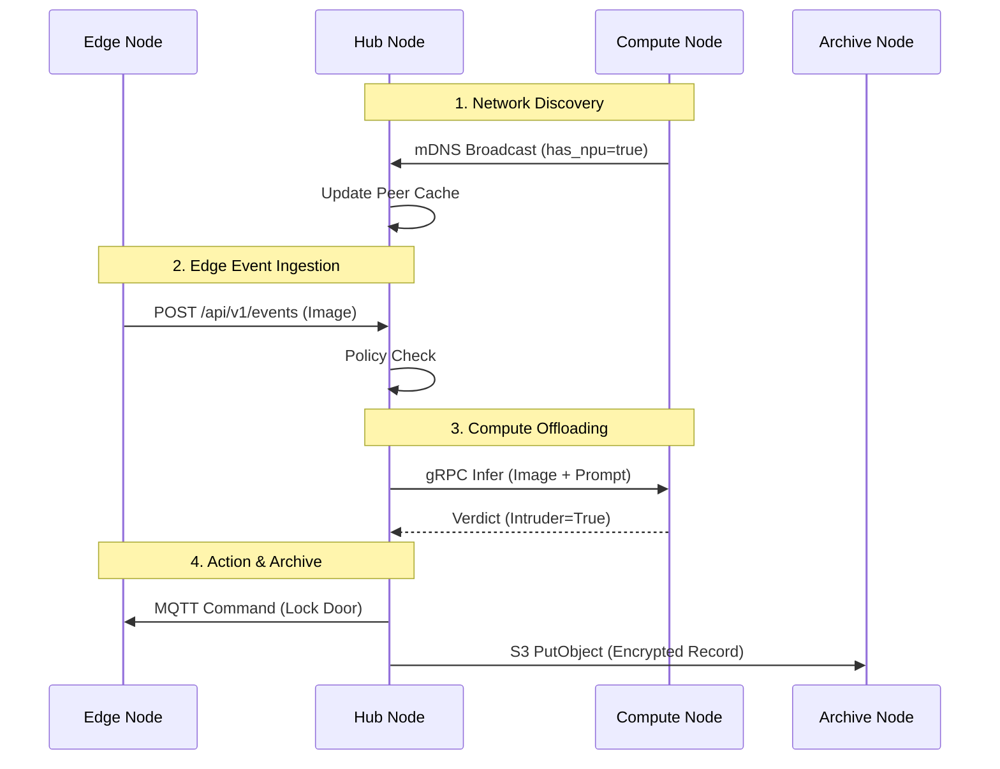

# Qonclave Open Ecosystem Communication Protocols

To transition Qonclave from a closed reference architecture into an **open, accessible ecosystem**, the framework is strictly **Transport Agnostic**. The schemas defined below are data-link independent—meaning they can be transmitted over IP networks (WiFi/Ethernet), Bluetooth Low Energy (BLE GATT), LoRaWAN, Zigbee, or even custom serial radio links.

While we define **Reference IP Bindings** (like HTTP, MQTT, and mDNS) for standard development, developers can plug into the Qonclave mesh using any physical medium or transport protocol, provided the payload schemas are respected.

Below are the 7 required communication planes, their strict JSON payload schemas, and a global dictionary of accepted values.

---
## 1. Network Discovery (Hub ↔ Hub ↔ Compute ↔ Edge)

**The Open Standard:** **mDNS / DNS-SD (Zeroconf)**

* **Why:** Custom UDP broadcasts require bespoke socket listeners that often conflict with network topologies. Standardizing on `mDNS` (Bonjour/Avahi) allows any device on the network (Mac, Linux, Windows, ESP32) to natively discover Qonclave nodes using built-in OS libraries.
* **How it works:** A developer building a new Compute Node in C++ simply registers a `_qonclave-compute._tcp` service. The Hub automatically discovers it and queries its `TXT` records to read its capability manifest.

**Payload Schema (mDNS TXT Record / Broadcast Payload):**
```json
{
  "service": "qonclave-node",
  "node_id": "uuid-a1b2c3d4",
  "node_type": "compute",         // Options: "edge", "hub", "compute", "archive"
  "tenant_id": "tenant-xyz",      // For multi-tenant physical network isolation
  "endpoints": {
    "http": "http://192.168.1.50:8000",
    "mqtt": "tcp://192.168.1.50:1883"
  },
  "capabilities": {
    "hardware": ["npu", "x86"],
    "supported_models": ["Qwen2.5-VL-7B"]
  },
  "load": {
    "cpu_percent": 85.0,
    "active_tasks": 2
  }
}
```

---

## 2. Edge Ingestion (Edge → Hub)

**The Open Standard:** **REST + MQTT + CoAP**

* **Why:** HTTP is great for high-bandwidth cameras uploading heavy image frames, but it is terrible for ultra-low-power constrained sensors (e.g., coin-cell temperature sensors waking up for 10 milliseconds).
* **How it works:** The Hub exposes a tri-modal ingestion gateway:
  1. **HTTP/REST (`POST /api/v1/events`):** For rich media (Cameras, Microphones).
  2. **MQTT (`qonclave/events/inbound`):** For continuous, lightweight telemetry (Motion sensors, Door contacts).
  3. **CoAP (Constrained Application Protocol):** For ultra-low-power battery devices that cannot sustain TCP connections and require UDP-based event pushing.

**Payload Schema:**
```json
{
  "event_id": "evt-999888",
  "source_node_id": "cam-front-door",
  "timestamp": "2026-08-03T18:41:00Z",
  "trigger": "motion_detected",
  "confidence": 0.95,
  "payload": {
    "media_type": "image/jpeg",
    "data_encoding": "base64",
    "data": "/9j/4AAQSkZJRgABAQEASABIAAD...<BASE64_STRING>"
  },
  "metadata": {
    "battery_level": 42,
    "temperature_c": 22.5
  }
}
```

---

## 3. Compute Offloading (Hub → Compute Node)

**The Open Standard:** **gRPC / Protocol Buffers**

* **Why:** HTTP/JSON is slow, heavy, and incurs massive parsing overhead when passing large multi-megabyte image tensors back and forth across the network during high-speed tracking.
* **How it works:** Qonclave provides public `.proto` definitions. Transitioning to **gRPC** ensures lightning-fast, binary-packed RPC calls. Developers can automatically generate gRPC clients in any language, making it trivial to plug a custom GPU cluster into the Qonclave mesh without writing manual HTTP wrappers.

**Request Schema:**
```json
{
  "task_id": "task-777",
  "model_id": "Qwen2.5-VL-7B",
  "prompt": "Is there an armed intruder in this image? Return JSON.",
  "max_tokens": 256,
  "payload": {
    "media_type": "image/jpeg",
    "data_encoding": "base64",
    "data": "/9j/4AAQSkZJRgABAQEASABIAAD...<BASE64_STRING>"
  }
}
```

**Response Schema:**
```json
{
  "task_id": "task-777",
  "status": "success",
  "compute_time_ms": 450,
  "result": {
    "intruder": true,
    "weapon": "crowbar",
    "confidence": 0.98
  }
}
```

---

## 4. Edge Actuation & Commands (Hub → Edge)

**The Open Standard:** **MQTT with AsyncAPI Schema Enforcement**

* **Why:** MQTT is already the undisputed king of IoT actuation. It naturally handles asynchronous commands and offline queuing (QoS 1/2) for devices that might temporarily lose signal.
* **How it works:** The Hub publishes signed JSON payloads to `qonclave/commands/<node_id>`. A third-party developer building a smart lock just needs to subscribe to their specific MQTT topic and parse the standardized JSON command. 

**Payload Schema:**
```json
{
  "command_id": "cmd-111",
  "issuer_id": "hub-alpha",
  "action": "lock_door",
  "parameters": {
    "timeout_seconds": 30,
    "force_override": false
  },
  "signature": "3045022100e...<CRYPTO_SIGNATURE>",
  "timestamp": "2026-08-03T18:41:05Z"
}
```

---

## 5. Direct-Bind Telemetry (Edge ↔ Compute / External)

**The Open Standard:** **WebRTC & RTSP**

* **Why:** For advanced autonomy (like drone tracking) or remote video streaming, routing heavy, continuous telemetry through the Hub introduces unacceptable latency and chokes the Hub's CPU.
* **How it works:** The Hub acts exclusively as a **WebRTC Signaling Server**. The Edge camera asks the Hub for permission to stream. The Hub verifies cryptographic permissions and exchanges SDP tokens between the Edge and the Target Compute Node. From then on, the Edge streams WebRTC peer-to-peer (or RTSP for legacy NVRs), bypassing the Hub entirely to achieve microsecond latency.

---

## 6. External Alerting (Hub → Operator)

**The Open Standard:** **Generic Webhook Egress**

* **Why:** Open enterprise use cases (Hospitals, Factories, Corporate Security) do not want hardcoded SMS platforms. They rely on existing infrastructure like Slack, Microsoft Teams, PagerDuty, or custom enterprise APIs.
* **How it works:** Qonclave implements a generic **Egress Webhook Engine**. A developer defines a webhook URL and a Jinja template. When an event is verified by the Policy, the Hub simply HTTP POSTs the rendered JSON payload to the external service, totally agnostic to who is receiving it.

---

## 7. Historical Archiving (Hub → Archive Node)

**The Open Standard:** **S3-Compatible Object Storage (MinIO) or GraphQL**

* **Why:** Enterprises already maintain massive, compliant data lakes. Qonclave should not force them to use a proprietary Archive Node if they already have an S3 bucket or a secure PostgreSQL cluster.
* **How it works:** The Archive interface mocks the **S3 API**. A Hub uploads the event JSON and image blob via standard S3 PutObject commands. This allows a user to point the Hub at a local MinIO server, AWS S3, or a custom Archive backend seamlessly, satisfying strict compliance protocols (HIPAA/GDPR) using their own vetted tools.

**Payload Schema (JSON representation in Object Storage):**
```json
{
  "event_id": "evt-999888",
  "tenant_id": "tenant-xyz",
  "timestamp": "2026-08-03T18:41:10Z",
  "event_data": { 
    "source_node_id": "cam-front-door",
    "trigger": "motion_detected"
  },
  "hub_decision": {
    "action_taken": "sms_alert_sent",
    "policy_triggered": "Nighttime Intrusion",
    "vlm_analysis": {
      "intruder": true,
      "weapon": "crowbar"
    }
  },
  "audit": {
    "handled_by_hub": "hub-alpha",
    "compute_node_used": "compute-beta",
    "processing_time_ms": 850
  }
}
```

---

## 8. Sequence Flow: Discovery & Offloading

To tie these independent protocols together, here is how an Edge node's event flows through the mesh:


