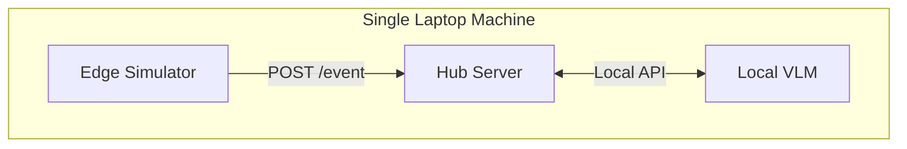
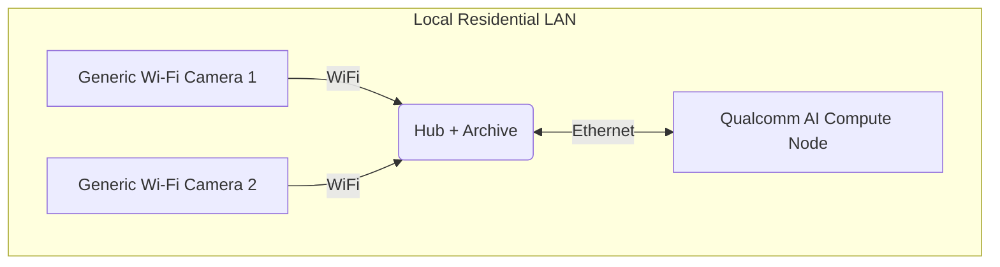
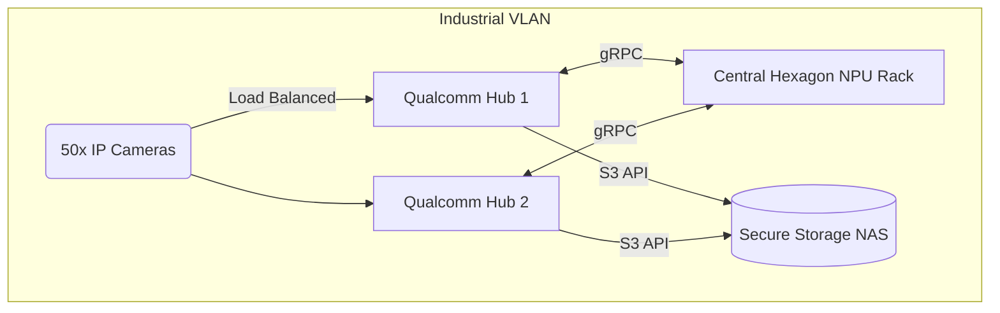

# Qonclave Deployment & Hardware Provisioning Guide

This guide outlines the hardware requirements and standard deployment topologies for a Qonclave network. Because Qonclave is decentralized and modular, you can run an entire test network on a single laptop, or scale it out to a distributed industrial mesh.

---

## 1. Hardware Requirements

### The Edge Node (Sensors/Actuators)
* **Architecture:** ARM Cortex-M (Microcontrollers), Qualcomm QCC Series, Generic Low-Power Edge Boards, or standard IP Cameras.
* **Requirements:** Network connectivity (WiFi, Ethernet, or LoRa).
* **Role:** Lightweight ingestion and command actuation. Capable of running basic Tier-1 heuristics (e.g., OpenCV motion detection) to avoid flooding the Hub.

### The Hub (The Orchestrator)
* **Architecture:** x86_64 or ARM64 (e.g., Qualcomm RB5, Generic ARM64 SBCs, or standard Linux/Windows server).
* **Requirements:** 2GB+ RAM, stable LAN connection.
* **Role:** Runs the `qonclave-hub` Python server. Manages the Policy logic, event ring-buffers, and network routing. It does *not* require an NPU/GPU if Compute Nodes are present on the network.

### The Compute Node (The Muscle)
* **Architecture:** Snapdragon X Elite (Hexagon NPU), Qualcomm Cloud AI 100, or any dedicated NPU rig.
* **Requirements:** 16GB+ RAM (for loading 7B parameter Vision-Language Models), NPU runtime drivers (e.g., `qairt`).
* **Role:** Executes heavy ML inference statelessly. Exposes the `/api/v1/compute/infer` gRPC/HTTP endpoint.

### The Archive Node (The Memory)
* **Architecture:** Any standard storage server, NAS, or local Kubernetes cluster.
* **Requirements:** High-capacity redundant storage (RAID), AES-NI for fast encryption at rest.
* **Role:** Accepts finalized event JSONs and image blobs from the Hubs for long-term cold storage.

---

## 2. Standard Deployment Topologies

### Topology A: "The Monolith" (Development / Testing)
The simplest way to build a Qonclave app is to run all node roles on a single powerful machine.

* **Hardware:** 1x Snapdragon X Elite Laptop (Windows/Linux).
* **Setup:** The laptop runs the Edge Simulator (browser), the Hub Server, and the Compute Node (GenieX VLM) simultaneously on `localhost`.
* **Best For:** Prototyping Policies, writing integration tests, and local development.

### Topology B: "The Smart Home"
A standard residential or small-business deployment.

* **Hardware:** 
  * 4x Generic Wi-Fi Cameras (Edge).
  * 1x Qualcomm RB5 (Hub + Archive).
  * 1x Local Qualcomm RB5 or Snapdragon PC (Compute).
* **Setup:** The Qualcomm RB5 acts as the low-power always-on Hub, orchestrating the cameras. When an event requires VLM verification, the Hub proxies the image to the Qualcomm Node over the LAN. 
* **Best For:** Environments that require high-tier AI but want to minimize power consumption by keeping the heavy Compute node asleep until explicitly woken via Wake-on-LAN (WoL).

### Topology C: "The Industrial Mesh" (Multi-Tenant / Enterprise)
A sprawling, highly resilient deployment for factories or apartment complexes.

* **Hardware:**
  * 50x IP Cameras & Radar Sensors (Edge).
  * 5x Qualcomm RB5 Compute Platforms (Hubs - distributed across the physical site).
  * 1x Centralized Qualcomm Cloud AI 100 Server Rack (Compute Pool).
  * 1x Secure NAS (Archive).
* **Setup:** The Edge devices are load-balanced across the 5 Hubs. The Hubs share the centralized NPU rack for inference. If Hub 1 loses power, Hub 2 detects the missing mDNS heartbeat and takes over Hub 1's Edge devices seamlessly. 
* **Best For:** Mission-critical operations requiring High Availability (HA) and massive concurrent event processing.

---

## 3. Network Provisioning Checklist

Before turning on your nodes, ensure the physical network is configured correctly:

1. **Subnet Isolation:** Place all Qonclave nodes on a dedicated VLAN.
2. **Egress Firewall Rules:** Block outbound internet access (WAN) for all Edge and Compute node IPs.
3. **Hub Gateway Setup:** Allow the Hub IP limited outbound HTTP(S) access *only* to necessary webhook endpoints (e.g., Twilio, Slack, or enterprise APIs).
4. **mDNS Support:** Ensure IGMP Snooping and Multicast (UDP Port 5353) are enabled on your switches to allow mDNS discovery between nodes.
