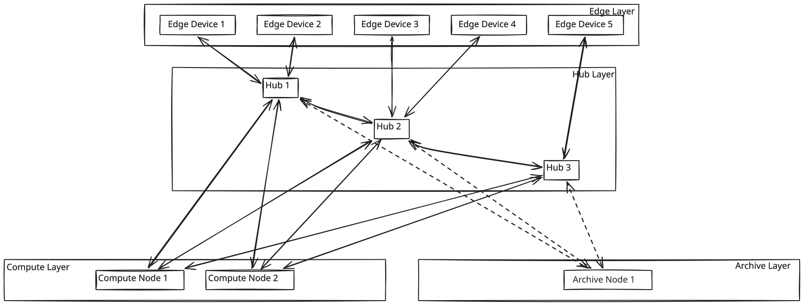

# The Ideal Qonclave Framework Architecture

  
*[Edit Topology in Excalidraw](assets/architecture/baseline.excalidraw)*

If we step back from the current code and hardware, the Qonclave Framework should be defined as a **hardware-agnostic, use-case-agnostic middleware**. Its sole purpose is to manage the complex plumbing of a decentralized, privacy-first AI mesh, allowing a developer to simply drop in their custom "Policy" (the business logic) without worrying about how nodes talk to each other.

Here is how the responsibilities should be divided in a generalized ecosystem:

## 1. Node Responsibilities

### The Edge (Sense, Act, Interact)
The edge is the nervous system. It sits in the physical world but is computationally constrained.
* **Continuous Ingestion (Sense):** Always listening/watching the physical environment via cameras or mics.
* **Triage (Tier 1 AI):** Runs ultra-lightweight, generalized heuristics (e.g., "Is there motion?" or "Is this a human shape?"). Its job is to filter out 99% of the noise so the network isn't flooded. Triage is the *typical* edge workload, not a ceiling — an edge with an NPU may run the heavy model itself when latency, privacy, or a dead uplink calls for it. See §4.
* **Actuation (Act):** Controls local physical hardware (buzzers, smart locks, robotic arms) based on commands from the Hub.
* **Human Interface (Interact):** Headless displays or touch-panels that subscribe to the Hub's state to render UI for humans and publish touch-events.
* **Constrained Edge (Edge-Only):** Ultra-low-power devices (like coin-cell battery sensors) that are permanently locked into the Edge role. They lack the hardware to ever dynamically promote to a Hub or run complex discovery protocols.
* **Agnosticism:** An Edge camera doesn't know it's a "Baby Monitor." It just knows "I saw a human shape, I am sending this event to the network."

### The Hub (The Orchestrator)
The Hub is the local brain and traffic cop. It does not necessarily do the heavy thinking, but it decides *what* needs to be thought about.
* **Policy Enforcement:** This is where the developer's specific use-case lives. The Hub receives an agnostic event ("human shape") and applies the app logic ("If it's past 10 PM, verify if it is an intruder").
* **Routing & Delegation:** If the Policy requires heavy AI verification, the Hub finds the best available Compute node on the network and delegates the task.
* **Protocol Translation:** Acts as a bridge to external legacy systems (e.g., Zigbee, Modbus), translating their signals into standard Qonclave MQTT events.
* **State & Memory:** Maintains the local event history, ring buffers, and dashboard state.
* **The Gateway:** The Hub is the *only* node authorized to reach the outside world (e.g., sending an SMS or push notification).

### The Compute Node (The Muscle)
The Compute layer is pure, stateless muscle (e.g., NPUs, GPUs, TPUs).
* **Heavy Lifting (Tier 2+ AI):** Executes large Vision-Language Models, LLMs, or complex aggregations. Note that "Tier 2" names a *class of work*, not this node: a Hub with a capable NPU runs the same work locally when no Compute node is present, which is why the role is optional (§4).
* **Stateless Execution:** A Compute node has no idea what the application is. It simply receives a standardized payload (e.g., an image and a prompt), executes the model, and returns a JSON result.
* **Hardware Abstraction:** It abstracts the underlying hardware. The framework shouldn't care if it's a Snapdragon Hexagon NPU or an Nvidia GPU; the Compute node exposes a generic interface for the Hub to use.
* **Multi-Tenant Sandboxing:** Because Compute nodes can be shared across multiple Hubs (and therefore multiple tenants) on the same physical network, they guarantee absolute statelessness. No context, images, or model history are retained between back-to-back inference calls, ensuring zero data leakage between Tenant A and Tenant B.

### The Archive Node (The Memory)
The Archive layer is dedicated to long-term, persistent storage.
* **Tenant-Specific Isolation:** Unlike Compute nodes, Archive nodes cannot be shared across multiple tenants. Each tenant must deploy their own dedicated Archive node to ensure complete physical and logical isolation of historical data at rest.
* **Multi-Hub Aggregation:** In a sprawling network (e.g., 5 Hubs in a single factory owned by one tenant), you don't want to query 5 different hubs for a historical event. The Archive Node acts as a single source of truth, subscribing to all verified events across that tenant's local mesh.
* **Cold Storage & Compliance Mechanics:** Beyond simple 30-to-90 day retention, the Archive node enforces strict compliance primitives required for HIPAA, GDPR, or CCPA. This includes mandatory encryption-at-rest for all saved events, immutable access-audit logging (recording exactly which Hub or operator queried which file), and automated cryptographic erasure (Right-to-Be-Forgotten) allowing tenants to permanently purge specific datasets upon request.
* **Zero Historical Overhead on Hubs:** By decoupling long-term storage, Hubs are freed from maintaining massive persistent databases. While a Hub must maintain *ephemeral operational state* (like current network topology, active permissions, and short-term event ring buffers), it is completely decoupled from historical state. This allows the Hub to dedicate 100% of its CPU/RAM to real-time orchestration rather than massive disk I/O.

---

## 2. Discovery: How and When

A decentralized network must be self-organizing. Nodes cannot rely on hardcoded IP addresses.

**How do they discover each other?**
* **Local Broadcasts:** Using UDP Broadcasts or mDNS (ZeroConf) restricted strictly to the local subnet.
* **Capability Manifests:** When a node broadcasts its existence, it doesn't just say "I am here." It broadcasts a standardized manifest: 
  * `Node Type`: Edge, Hub, or Compute.
  * `Capabilities`: (e.g., "Camera: 1080p", or "Compute: VLM, 15 tokens/sec").
  * `Load`: Current utilization (e.g., "CPU at 90%").

**When do they discover each other?**
* **Boot Time:** The moment a node powers on, it broadcasts a "Hello" packet to the subnet to announce its manifest.
* **Event-Driven Polls:** If an Edge device wakes from sleep with a critical event, it blasts a UDP probe asking "Who is the active Hub?"
* **Continuous Heartbeats:** Nodes emit lightweight broadcasts every few seconds to prove they are alive and to update their Load metrics.

---

## 3. Maintaining Network Health

To be robust, the framework must proactively manage the health of the mesh:

* **Liveness & Peer Handoff:** Through continuous heartbeats, the network knows if a node dies. If "Hub A" goes offline, "Hub B" must detect the missing heartbeat and seamlessly take over orchestration for Hub A's Edge devices.
* **Dynamic Load Balancing:** Because Compute nodes broadcast their current `Load` in their heartbeats, a Hub can intelligently route heavy VLM tasks to the Compute node that is currently the least busy, preventing thermal throttling.
* **Network Congestion Control (Backpressure):** If the network is degrading (high latency/packet loss), the Hub must be able to send a control signal to the Edge devices instructing them to lower their frame rates or increase their Triage thresholds to reduce bandwidth.
* **Peer Authentication & Out-of-Band Commissioning:** To prevent rogue devices from joining the local network, the framework requires a cryptographic handshake. Standard nodes use TLS certificates generated during initial pairing. However, for "Constrained Edge" battery-powered devices that cannot run heavy discovery broadcasts, they are commissioned *out-of-band* (e.g., scanning a QR code on the physical device). This securely passes the device's specific protocol address and pre-shared key to the Hub so the Hub can initiate the trusted connection.
* **Multi-Tenant Permissions:** To support shared physical networks (like apartment buildings or co-working spaces), the Hub establishes rigid permission boundaries. It logically isolates Tenant A's Edge devices from Tenant B's, ensuring no data leaks across the shared subnet.
* **Direct-Bind Broker (Zero-Latency & Remote Streaming):** Pushing every packet through the Hub creates a severe network bottleneck for continuous 4K video streams or ultra-low latency robotics. The Hub solves this by acting strictly as an authorization broker. Once permissions are verified, an Edge device can stream data *directly* to a local Actuator/Compute node, or even establish a temporary WebRTC peer-to-peer connection to an external remote user (e.g., a homeowner's phone). The Edge device remains completely air-gapped to the internet until the Hub explicitly hands it a secure, temporary streaming token, bypassing the Hub to achieve microsecond latency without compromising the air-gap.
  * **A third target: another Hub.** The same primitive covers an Edge talking to a *foreign* Hub, and this is what makes the peer handoff above actually work. An orphaned Edge cannot simply start reporting to Hub B — Hub B has no reason to trust it. Its home Hub issues a **capability grant** naming Hub B as the audience, which Hub B verifies *offline* against a pinned issuer root. Offline is the whole point: a mesh that needs the home Hub online to authorize failover has not failed over. `SECURITY.md` §5 and `spec/v1/json-schema/capability-grant.schema.json` define the grant; `COMMUNICATION.md` §5 defines the exchange.
* **Dynamic Role Promotion (Hub Election):** Any Qonclave device can dynamically take up Hub orchestration functionality if no existing Hub is found on the network. However, once a better-suited device joins (e.g., a node with significantly higher CPU/RAM broadcasting a Hub manifest), the temporary Hub will intelligently demote itself back to its fundamental role (e.g., Edge) to shed the unnecessary processing overhead.

---

## 4. Placement: Where Inference Runs

The sections above describe what each **role** is for. They do not decide where a given piece of
work executes, and it would be a mistake to read them that way. A role is a set of
responsibilities a node has taken on; **placement is a decision made per request**, against
conditions that change between one request and the next.

The distinction matters because the alternative is a network where an edge with an idle NPU ships
a frame to a saturated hub because that is what the diagram says, or one where a 30 ms control
loop waits on a network hop it could have skipped.

**What is declared vs. what is measured.** The application declares intent about the *task*; the
framework measures facts about the *nodes*. Neither side guesses at the other's half:

| The app declares (per request) | The framework measures (per node) |
|---|---|
| `complexity` — the model class the work needs | `power` — battery %, on-mains, thermal headroom |
| `urgency` / `deadline_ms` | `load` — CPU and active tasks, from the manifest in §2 |
| `privacy` — may this leave the device or the subnet? | `capabilities` — what this node can actually run (§2) |
| `use_case` | `rtt_ms` — measured latency to each reachable tier |

A developer never writes "run this on the hub." They subclass `PlacementPolicy` and express the
*conditions*; the framework resolves them to a tier against live state, walks the fallback chain
when the chosen tier is unreachable, and deducts the elapsed time from the deadline before
handing the task on. There is no rule file and no DSL — the decision is ordinary code, in the same
idiom as the `Policy` in §1.

**Consequences for the roles above:**

* **The ladder is `edge → hub → compute`, and every rung is optional except the first.** A
  single-laptop deployment collapses it to `[edge, hub]` and is a supported production topology,
  not a development mode.
* **A Hub doing its own VLM work is normal**, not a degraded fallback. That is why the Compute
  role is optional: the *capability* to run a model lives in a shared layer that any role can use,
  and the Compute Node is just a server that exposes that capability over the network.
* **Some placements the framework refuses regardless of what a policy returns.** A task marked
  `no_egress` cannot be sent to a shared multi-tenant Compute node, and the ladder enforces that
  after the policy has decided — because the multi-tenant isolation guarantee in `SECURITY.md` §2
  must not depend on every application author remembering it.
* **A peer Hub is another candidate at the `HUB` rung**, not a new tier. Placement asks *which
  tier*; the capability grant decides *which instances of that tier are permitted*.

`PLACEMENT.md` is the full treatment: the metrics, the `PlacementPolicy` contract, and worked
examples.
