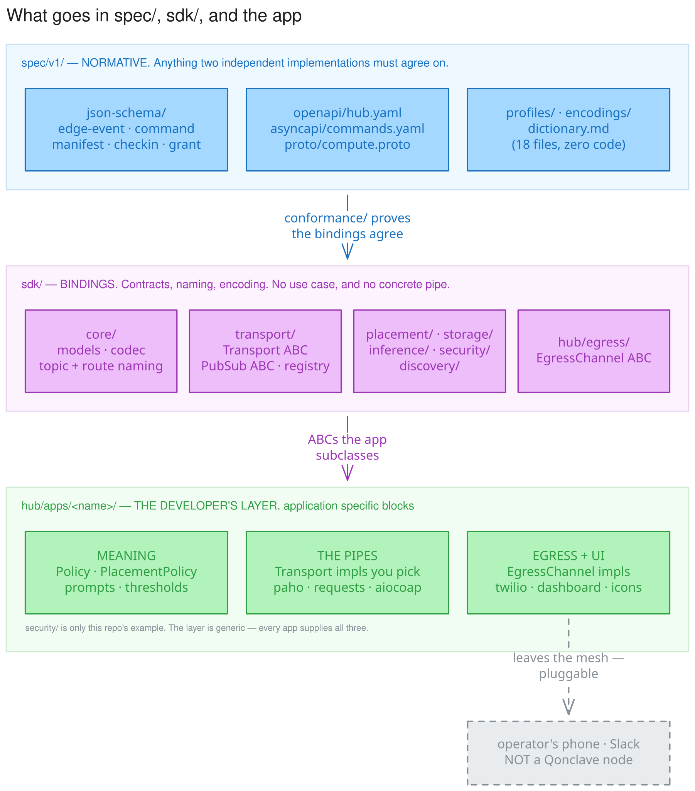

# Conventions

The rules that keep this package coherent. Two of them are enforced by tests rather than by
review, because a layering rule that lives only in a document is one that gets broken during the
first tired refactor and stays broken until someone finds Flask on a sensor.

  
*[Edit in Excalidraw](assets/conventions/layering.excalidraw)*

Three layers, three questions:

| Layer | The question it answers | The test |
|---|---|---|
| `spec/v1/` | What must every implementation agree on? | Could a C edge and a Python hub disagree about it? |
| `sdk/` | How is that agreement expressed in code? | Is it a contract, a name, or an encoding? Then yes. Is it a library that opens a socket? Then no. |
| `hub/apps/<name>/` | What does any of it *mean*, and what carries it? | The application-specific blocks: the only layer where "person" appears, and the only layer that picks a client library. |

`security/` is this repo's example, not the definition. Every app supplies all three of the green
blocks — its own meaning, its own pipes, its own egress.

**The SDK owns the contract, the naming, and the encoding. The developer supplies the pipe.**

This is the rule that is easiest to get backwards, so state it concretely. `transport/` holds the
`Transport` and `PubSubTransport` ABCs and the scheme registry. It does **not** hold a `paho`
client, a `requests` session, or an `aiocoap` context — those are the developer's choice, and they
live wherever that developer wants them. The same applies to egress: `EgressChannel` is the
contract, and a Twilio client is not.

What stays normative is only the part two implementations could disagree about. A developer who
writes their own MQTT transport must still publish to `qonclave/commands/<node_id>` carrying a
spec `Command` — so that naming lives in `core/`, as spec-derived data, testable by
`conformance/` with no broker anywhere in sight. Put the topic string in the transport
implementation instead and it drifts once per application, which is exactly how this repo already
ended up with two incompatible topic layouts.

"The developer's choice" is bounded, not unbounded: [`spec/v1/profiles/`](../spec/v1/profiles/) says
a `full` node must be reachable over HTTP, MQTT, and gRPC, while a `minimal` one owes nothing more
than "one exchange, any link." The profile fixes *what must be supported*; the developer picks
*what implements it*.

---

## 1. The spec is normative; code is a binding

`spec/v1/` defines what a document means. `sdk/*/` are implementations. Where they disagree, the
SDK is wrong and the fix goes in the SDK.

Consequences worth stating:

- **Never change a schema to match code.** Change the code, or version the spec.
- **Additive changes only within v1.** New optional fields, new values in open sets, new entries
  appended to the CBOR key map. Removing a field, tightening a constraint, or reusing a CBOR key
  number requires v2 — devices commissioned years earlier are still in the field and cannot be
  updated.
- **`conformance/` is the arbiter.** A behavior that matters across implementations belongs in a
  fixture, not only in a Python test.

---

## 2. The dependency ladder

*Enforced by `sdk/python/tests/test_layering.py`.*

```
core                              imports nothing from qonclave
  ↑
transport, security               import core only
  ↑
discovery                         peer manifests, liveness, load
  ↑
placement                         decides WHICH tier runs a task
  ↑
inference, storage                ask placement, then execute
  ↑
edge | hub | compute | archive    import layers below — NEVER each other
  ↑
app, cli
```

**Roles never import siblings.** A hub reaches a compute node through `transport`, not by
importing `qonclave.compute`.

This is not tidiness. It is what makes two claims in the README true rather than aspirational:

- `pip install qonclave[edge]` lands without Flask, paho, or Twilio.
- Compute and Archive are genuinely optional, because nothing structurally depends on them.

It also encodes at the import level what `SECURITY.md` §2 asserts architecturally: compute is a
*remote, stateless* resource, not an in-process library call.

### Where a capability goes

The rule that decides this: **if more than one role needs it, it belongs below the roles.**

| Capability | Layer | Optional role that serves it remotely |
|---|---|---|
| running a model | `inference/` | `compute/` |
| persisting a record | `storage/` | `archive/` |
| deciding where work runs | `placement/` | — |
| naming a topic or route | `core/` | — |
| **carrying bytes** | `transport/` — **the ABCs and registry only** | the client library lives in the **app** |
| **reaching a human** | `hub/egress/` — **the ABC only** | the vendor client lives in the **app** |

The last two rows are what this table originally got wrong, in the same way twice. The framework
must be in both paths — `SECURITY.md` §1 makes the hub the only node permitted egress, and
placement cannot promise a deadline the layer beneath it may block past, which is why
`Transport.request` obliges implementations to honor `timeout_s`. But being in the path means
owning the **contract**, not shipping the **client**. `paho`, `requests`, `aiocoap`, `grpcio`, and
`twilio` are all the same kind of thing: somebody else's library for reaching somebody else's
process. None of them belong in a binding whose whole claim is to be transport- and
vendor-agnostic.

Putting `ModelBackend` inside `compute/` was the original design and it was wrong: a hub doing its
own VLM work would have had to import the optional server it is supposed to be able to do without.

---

## 3. Documentation lives next to the thing

- A module docstring states the module's responsibility, the spec/doc section it implements, and
  the `hub/framework/` module it will absorb.
- Comments explain **why**, not what. `# increment counter` is noise; `# doubles as the replay
  guard` is the reason the line exists.
- Prose in `docs/` explains rationale. Where prose and schema disagree, the schema wins and the
  prose is a bug.

---

## 4. Failure conventions

- **Best-effort subsystems return, they do not raise.** An unreachable broker, a missing model, or
  an absent battery sensor must not fail a request that was otherwise handled. This is the
  existing framework's "runs anywhere" behavior and it is deliberate.
- **Verification paths never crash on bad input.** `capability.verify` returns
  `VerificationResult(valid=False, ...)` for anything malformed. A device presenting garbage
  should be rejected, not able to take a hub down.
- **Different outcomes get different exceptions.** `PlacementError` and `PlacementDeferred` are
  not interchangeable: on a duty-cycled device, "retry later" may mean tomorrow.

---

## 5. Constrained devices are a design constraint, not a special case

Before adding anything to a message or a flow, ask what it costs a device that wakes for 200 ms
once a day:

- **Round trips are the budget**, not bytes. Radio-on time is what drains the battery.
- **Discovery is not free.** An mDNS browse can cost more than the entire useful exchange.
- **A day-old command is a hazard.** Anything time-sensitive carries `expires_at`, and the
  decoder drops expired commands below the application layer rather than trusting each firmware
  author to check.
- **A spool in RAM is not a spool.** It must survive the sleep cycle.

---

## Where existing code lands

`hub/framework/` is untouched and still runs the demo. When convergence happens, this is the map:

| Today (`hub/framework/`) | Target (`sdk/python/src/qonclave/`) |
|---|---|
| `policy.py` | `hub/policy.py` |
| `server.py` | `hub/app.py` |
| `transport.py` | `hub/ingest.py` — the Flask half stays in the app |
| `events.py`, `recognize_activity.py` | `hub/events.py` |
| `mqtt_bus.py` | **stays put** — it is the demo's chosen pipe, wrapped in `PubSubTransport` |
| `sms_bus.py` | `apps/<name>/egress/twilio_sms.py` — **leaves the framework** |
| `server.py`'s `POST /sms` route | `apps/<name>/` — it reads Twilio's own form fields |
| `discovery.py` | `discovery/backends/udp.py` |
| `vlm.py`, `llm.py` | `inference/local/geniex.py` |
| `face_id/` | `inference/local/face_id/` |
| edge-side `edge_confidence` threshold | a `PlacementPolicy` — no longer hardcoded |
| `icons.py` | **stays app-level** |

Two of these are worth explaining.

`vlm.py`/`llm.py`/`face_id/` land in `inference/local/`, **not** `compute/`. That is rule 2 in
practice, and it is what lets today's single-laptop hub keep doing its own VLM work with no
compute node present.

`icons.py` is LED-icon rendering — use-case-specific logic that already violates `AGENTS.md`'s own
rule against app logic in the framework. The new layout gives it nowhere to go, which is the
correct outcome rather than an oversight.

`sms_bus.py` is the same mistake, less visibly, because "notifications" sounds infrastructural.
It is 195 lines of `TWILIO_ACCOUNT_SID`, `from twilio.rest import Client`, and one hardcoded
recipient. Twilio appears nowhere in `spec/v1/`, and the SDK's own `egress/webhook.py` docstring
already argues the point: enterprises "do not want a hardcoded SMS vendor."
