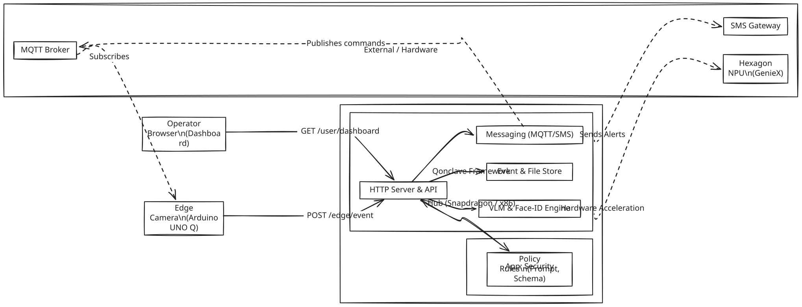
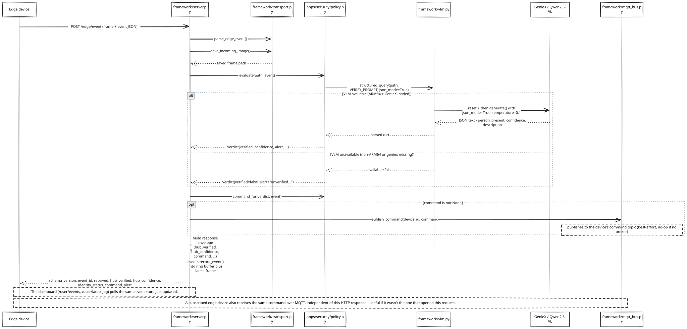

# Qonclave Developer Guide

This guide details the technical implementation of the current Python codebase located in `hub/framework/`.

## Architecture & Code Structure

This architecture outlines the separation between the generic framework and a specific application (living in `hub/apps/`).

  
*[Edit Architecture in Excalidraw](assets/developer_guide/architecture.excalidraw)*

### Framework vs. app

- **`framework/`** is reusable across use cases: it knows how to accept a frame + edge event over HTTP, run VLM inference, keep a ring buffer of recent events for a dashboard, and serve an app's static test pages. It has no idea what "person_present" or "fall_detected" means.
- **`apps/security/`** (in `hub/apps/security`) declares everything specific to stationary person-detection. A new use case (fall detection, hazard detection, ...) means writing a new `Policy` subclass in a new `apps/<name>/` package — no framework code changes.

The `Policy` contract (`framework/policy.py`):
```python
class Policy(ABC):
    name: str
    def evaluate(self, image_path: str, event: dict) -> Verdict: ...
    def command_for(self, verdict: Verdict, event: dict) -> dict | None:
        return None   # override to route a hub->edge command
```

Backends (`vlm`, `llm`, `face_id`) reach a Policy through its **constructor**, not through
`evaluate()`. That keeps the call signature stable: adding a capability would otherwise force
every existing Policy to change in order to gain something it does not use.

### Request flow: `POST /edge/event`

> [!NOTE]
> The current Python reference implementation uses `POST /edge/event` for edge ingestion. This will be updated to match the `POST /api/v1/events` Open Ecosystem standard in a future release.

  
*[Edit Sequence Flow in Excalidraw](assets/developer_guide/request_flow.excalidraw)*

`POST /user/reason` follows the same save-image -> VLM step, but calls the generic `VLMBackend.reason()` method directly (bypassing any Policy) and returns raw text instead of a structured verdict, and does **not** call `events.record_event()`.

### Data Movement & Privacy Cascade

Qonclave enforces a strict data lifecycle where the further data travels from the edge, the smaller and more abstract it becomes. The framework guarantees that raw sensor data never reaches the cloud.

| Stage | Data Form | Movement & Lifecycle |
|---|---|---|
| **Edge Device** | Raw Video / Sensor Feed | Processed continuously on-device. Never leaves the edge device during normal operation. |
| **Local Network (Edge → Hub)** | Encrypted Frame + JSON Event | Sent over the local network (e.g. WiFi/Matter) only when a local confidence threshold is crossed. |
| **Hub / Compute Node** | Ephemeral File | The frame is temporarily saved to `hub/uploads/` for VLM/Face-ID verification. Once verified and recorded, it is kept briefly for the local dashboard and then overwritten/discarded. |
| **External (Hub → SMS)** | Plain Text Alert | Only a human-readable text string (e.g., "Person verified near camera") is sent via Twilio to the operator. No images or raw data ever leave the local network. |

## Endpoints

All routes are generic (`framework/server.py`); only the app's `Policy` and static test pages vary per use case.

| Method | Path | Purpose |
|--------|------|---------|
| GET | `/health` | Liveness + VLM availability + MQTT status + face-ID status + active app name |
| GET | `/` | Redirects to `/user/dashboard` |
| GET | `/test/edge` | Edge-device simulator page |
| GET | `/test/hub` | Hub-side MQTT console |
| POST | `/test/mqtt/publish` | Generic MQTT publish proxy |
| GET | `/test/mqtt/messages` | Recently received MQTT messages |
| POST | `/edge/event` | Edge event JSON + frame in, policy-driven verification response out |
| POST | `/sms` | Twilio inbound-reply webhook |
| GET | `/user/dashboard` | Live event / verification dashboard page |
| GET | `/user/events` | Recent events + results (JSON) |
| GET | `/user/latest.jpg` | Most recent frame |
| GET | `/user/frames/<name>` | A specific stored frame |
| POST | `/user/reason` | Raw VLM tester: image in, reasoning text out |

## File Layout (`hub/framework/`)

```
framework/               # reusable, use-case agnostic
  server.py              # create_app(policy, vlm, mqtt, sms, STATIC_DIR, face_id, llm) -> Flask
  transport.py           # upload handling + edge-event parsing
  events.py              # event ring buffer for the dashboard
  vlm.py                 # VLMBackend: reason() + structured_query()
  mqtt_bus.py            # MQTTBus: publish_command() hub->edge push channel
  sms_bus.py             # SMSBus: send() SMS notifications via Twilio
  policy.py              # Policy ABC + Verdict + Notification dataclasses
  face_id/               # face detection + identification
```

## Push Channels

### MQTT broker (hub->edge push channel)
`/edge/event`'s `command` field only reaches a device if it has an HTTP request open at that moment. `framework/mqtt_bus.py` gives the hub a second, independent path to push the same command over MQTT.

### SMS notifications (hub->operator push channel)
`framework/sms_bus.py`'s `SMSBus` gives a Policy a way to push an SMS to an operator when a significant event is verified. The framework just sends whatever the Policy's `notify_for()` method returns.

## Quickstart: Build Your First App

This guide will walk you through building a simple "Hello World" Qonclave app. You will write a custom Policy that detects if a person is holding a coffee cup, and deploy it to a local Hub.

### 1. Prerequisites

For this quickstart, we will use **Topology A: The Monolith** (running everything on one machine).
* Python 3.10+
* (Optional) A Snapdragon X Elite laptop for true NPU-accelerated VLM inference. If you use a standard PC, the framework will gracefully fall back to returning mock responses for testing.

```bash
# Install framework dependencies
pip install flask python-dotenv paho-mqtt
```

### 2. Create Your App Directory

Navigate to the `hub/apps/` directory and create a new folder for your app.

```bash
mkdir -p hub/apps/coffeecam/static
cd hub/apps/coffeecam
```

### 3. Write Your Policy

The Policy is where your business logic lives. It takes an incoming edge event and decides what to do with it. Create `policy.py` inside your `coffeecam` folder:

```python
# hub/apps/coffeecam/policy.py
from framework.policy import Policy, Verdict

class CoffeePolicy(Policy):
    name = "coffeecam"

    def __init__(self, vlm):
        # Backends arrive here, not in evaluate() — see "Framework vs. app" above.
        self.vlm = vlm

    def evaluate(self, image_path: str, event: dict) -> Verdict:
        # We only care about motion events
        if event.get("event_type") != "motion_detected":
            return Verdict(verified=False, confidence=None,
                           alert="Ignored: not a motion event.")

        # Ask the heavy Compute Node (VLM) to verify the image
        prompt = "Is there a person in this image? If so, are they holding a coffee cup? Return a JSON object with keys 'person' (bool) and 'holding_coffee' (bool)."

        result = self.vlm.structured_query(image_path, prompt, max_new_tokens=100)

        if not result.get("available"):
            return Verdict(verified=False, confidence=None,
                           alert="Compute node unavailable.",
                           reasoning_available=False)

        # structured_query returns the model's JSON under "parsed", alongside the
        # raw "text" — read your fields out of parsed, never off the top level.
        parsed = result.get("parsed") or {}
        has_person = parsed.get("person", False)
        has_coffee = parsed.get("holding_coffee", False)

        if has_person and has_coffee:
            return Verdict(verified=True, confidence=None,
                           alert="Alert: Person with coffee detected!",
                           latency_s=result.get("latency_s"))
        elif has_person:
            return Verdict(verified=False, confidence=None,
                           alert="Person detected, but no coffee.")
        else:
            return Verdict(verified=False, confidence=None,
                           alert="False alarm. No person.")
```

### 4. Hook It Into The Server

Now, we need to tell the Qonclave Hub to load your new Policy instead of the default Security app. Open `hub/server.py` and swap out the Policy.

```python
# In hub/server.py

# 1. Import your new policy
from apps.coffeecam.policy import CoffeePolicy

# ...

# 2. Instantiate it, handing it the backends it needs
policy = CoffeePolicy(vlm)
STATIC_DIR = os.path.join(os.path.dirname(__file__), "apps", "coffeecam", "static")

# 3. Pass it to the framework factory
app = create_app(policy, vlm, mqtt, sms, STATIC_DIR, face_id, llm)
```

### 5. Test Your Network!

Start the Hub server:
```bash
cd hub
python server.py
```

Open a web browser and navigate to `http://localhost:8000/test/edge`. 
This is the Edge Simulator. It pretends to be an IoT camera. 

1. Click **Choose File** and upload an image of yourself holding a coffee cup.
2. Ensure the event type is set to `motion_detected`.
3. Click **Send Event to Hub**.

The image will be securely sent to the Hub. The Hub will execute your `CoffeePolicy`, route the image to the local VLM Compute instance, parse the JSON, and return the `Verdict(True)` alert!

## Roadmap & Future Ideas

### Hardware Capabilities API
Currently, developers have to manually check whether a given hub node supports specific features (like the Snapdragon Hexagon NPU for VLM acceleration). 

In the future, the framework should expose a dedicated API (e.g., `GET /capabilities`) that introspects the underlying hardware (OS, CPU, NPU presence) and returns an explicit list of supported AI models. This allows developers and orchestrating nodes to dynamically discover what models a specific hub can run without manual research or hardcoded assumptions.
