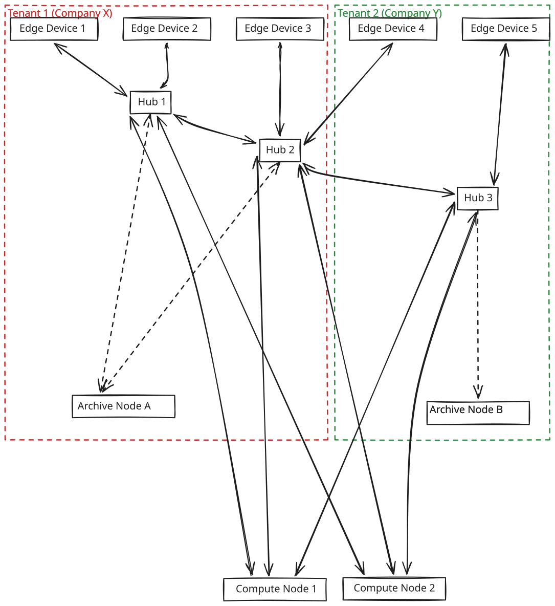
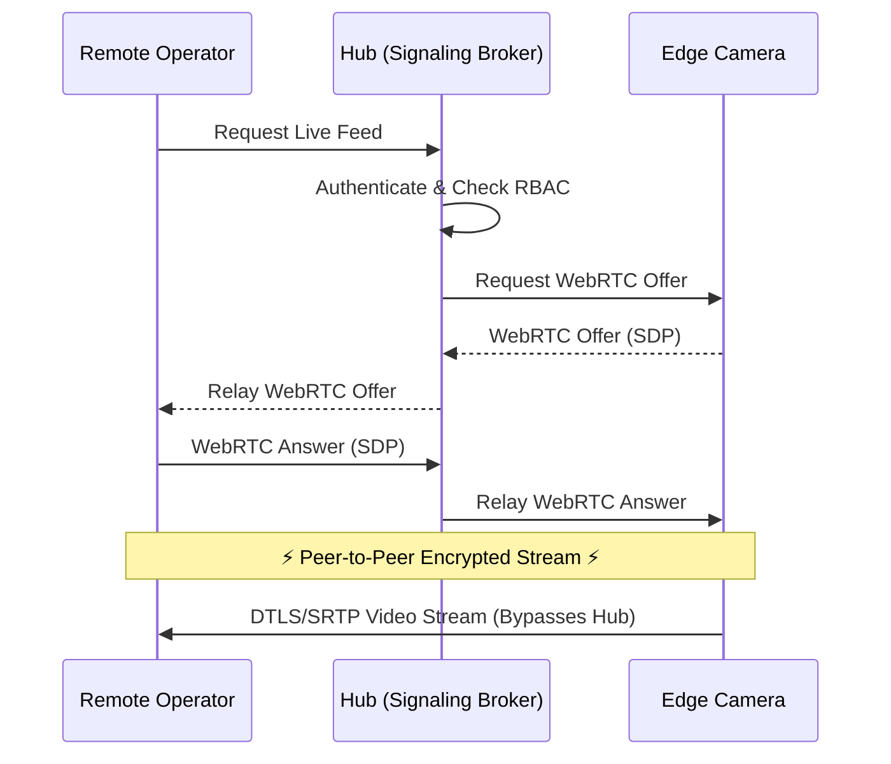

# Qonclave Security & Threat Model

Qonclave is fundamentally designed as a **privacy-first, air-gapped operating system for the physical world**. Unlike traditional IoT frameworks that rely on TLS-wrapped cloud connections, Qonclave assumes the cloud is fundamentally untrusted.

This document outlines the core security primitives, isolation guarantees, and threat mitigations built into the framework.

---

## 1. Zero-Trust Air-Gapping

Qonclave operates under a strict air-gap philosophy. No sensor data is ever required to leave the local physical subnet.

### Outbound Gateway Isolation
* **The General Rule:** Edge Devices (Cameras, Microphones, Sensors) and Compute Nodes (GPUs, NPUs) are strictly prohibited from having outbound internet access at the firewall level. They operate exclusively within the local network.
* **Authorized Data Egress:** Only the **Hub** is permitted to broker outbound connections, and it does so under strictly governed exceptions:
  1. **Metadata Alerts:** The Hub can push lightweight textual alerts (via webhooks) to the outside world when a high-confidence event occurs.
  2. **Direct-Bind Telemetry:** If an authorized external operator requests a live feed, the Hub brokers a secure WebRTC connection, allowing end-to-end encrypted video to securely leave the subnet directly to the operator's device.
  3. **Compliant Archiving:** The Hub can commit encrypted historical event payloads (including raw images/video) to a Tenant's dedicated Archive Node, even if that Archive Node is hosted off-site (e.g., AWS S3 or a remote corporate datacenter).
## 2. Multi-Tenant Logical & Physical Isolation

*[View Multi-Tenant Architecture in Excalidraw](assets/security/multi_tenant.excalidraw)*

In environments where multiple entities share physical infrastructure (e.g., an apartment building, a co-working space, or an industrial park), Qonclave enforces strict boundaries.

### Ephemeral Compute Sandboxing
Compute nodes are expensive resources (NPUs/GPUs) that are often shared across Tenants.
* **Statelessness:** The Compute Node executes in a completely stateless sandbox. Between back-to-back inference calls (even from different Hubs), memory is flushed. 
* **Zero-Leakage Guarantee:** Tenant A cannot extract weights, visual context, or prompt history generated by Tenant B's recent inference request.

### Archive Siloing
Unlike Compute Nodes, **Archive Nodes cannot be shared**.
* Each Tenant must deploy their own dedicated, physically or logically isolated Archive Node.
* This ensures that Tenant A's long-term historical records are entirely separated from Tenant B, eliminating the risk of cross-tenant database poisoning or accidental data leakage during compliance audits.

### Where the Boundary Is Actually Enforced
The isolation above is a property of the *authorization* layer, not of network layout. Two
mechanisms carry it, and both are described in §5:

* **Cross-tenant access is DENY by default.** Every capability grant carries a `tenant_id`, and a
  grant presented across a tenant boundary is refused unless it was explicitly minted with
  `cross_tenant: true`. Sharing a subnet never implies sharing data.
* **The framework refuses some placements outright.** A task marked `no_egress` will not be
  dispatched to a shared multi-tenant Compute node, and that check runs *after* the application's
  placement policy has decided, overriding it. A guarantee that depends on every developer
  remembering it is not a guarantee (`ARCHITECTURE.md` §4).

## 3. Cryptographic Identity & Transport Security

While the network is air-gapped from the public internet, the local subnet is still considered untrusted.

### Transport Security (mTLS & Link-Layer Crypto)
All network traffic between Nodes (Hub, Edge, Compute, Archive) is encrypted in transit. Because Qonclave is transport-agnostic, the encryption method matches the medium:
* **IP Networks (WiFi/Ethernet):** Traffic (HTTP/gRPC/MQTT) is secured using **mTLS**. Nodes refuse connections from unauthenticated clients.
* **Constrained/Non-IP Networks (Bluetooth, LoRa, Zigbee):** Traffic relies on strong link-layer encryption (e.g., BLE Secure Connections with AES-CCM) established during out-of-band commissioning.
* Certificates are provisioned by the Hub acting as a local Certificate Authority (CA) during the commissioning phase.

### Out-of-Band Commissioning
To prevent rogue devices from joining the Qonclave mesh:
* Standard nodes exchange certificates during a pairing mode.
* **Constrained Edge Devices** (e.g., battery-powered sensors lacking the CPU for heavy handshakes) are commissioned out-of-band. An operator scans a QR code on the physical device, transferring a Pre-Shared Key (PSK) directly to the Hub via a secure mobile app, allowing the Hub to establish a trusted connection without broadcasting secrets over the air.

### WebRTC DTLS/SRTP (Direct-Bind & Live Viewing)
In many security use-cases, an authorized operator or security guard needs to view a live camera feed without introducing latency or overwhelming the Hub's bandwidth by relaying 4K video through it.

* **The Hub as a Signaling Broker:** The Edge camera never accepts unsolicited streaming requests. When an operator requests the live feed, the Hub cryptographically authenticates the operator, enforces RBAC (Role-Based Access Control), and exchanges WebRTC SDP tokens between the Edge camera and the operator's viewing device.
* **Peer-to-Peer Encrypted Streaming:** Once brokered, the actual media stream flows directly from the Edge camera to the operator (bypassing the Hub). This stream is encrypted end-to-end using Datagram Transport Layer Security (DTLS) and Secure Real-Time Transport Protocol (SRTP). 
* **Zero Hub-Relay:** This ensures the Hub cannot become a bottleneck for live video viewing, while still maintaining strict centralized authorization control over who is allowed to view which cameras.

## 4. Compliance Mechanics (HIPAA, GDPR, CCPA)

Qonclave provides out-of-the-box primitives to satisfy strict legal data privacy requirements.

* **Encryption at Rest:** All data stored on the Hub (ephemeral ring buffers) and the Archive Node (cold storage) is encrypted at rest using AES-256.
* **Immutable Audit Logging:** Every read-access to the Archive Node is logged. If an operator views historical camera footage, the request is cryptographically signed and appended to a write-only audit ledger.
* **Right to Erasure (Cryptographic Shredding):** To comply with "Right to be Forgotten" requests, Qonclave supports cryptographic erasure. Tenant data keys can be destroyed, instantly rendering all associated archived events permanently unreadable, rather than relying on standard disk-deletion which can leave forensic traces.

## 5. Capability Grants (Brokered Access)

§3 describes the Hub brokering one specific thing: a WebRTC session for a remote operator. That is
one instance of a general primitive, and treating it as a special case is how a codebase ends up
with three subtly different authorization paths. There is one:

> The Hub is the issuer. An Edge device holds no standing authority to talk to anyone but its Hub.
> To reach anything else it presents a short-lived, signed **capability grant**, and the far side
> verifies it.

**Normative schema:** [`../spec/v1/json-schema/capability-grant.schema.json`](../spec/v1/json-schema/capability-grant.schema.json).

| field | meaning |
|---|---|
| `issuer` | the home Hub, already a local CA per §3 |
| `subject` | the Edge node the grant is about |
| `audience` | the **specific** target: an operator, a compute node, or a **peer Hub** |
| `scope` | the operations allowed — `post_events`, `stream`, `recognize`, … |
| `tenant_id` + `cross_tenant` | cross-tenant is denied unless explicitly minted otherwise |
| `not_before` / `expires_at` | short-lived by construction |
| `revocation_id` | revocable before expiry |

### The Three Audiences

| audience | what it replaces |
|---|---|
| **operator** | the WebRTC/DTLS flow in §3, unchanged in behavior |
| **compute node** | an Edge streaming directly to a local NPU without relaying through the Hub |
| **peer Hub** | *new* — an Edge reporting to a Hub that did not commission it |

### Why Verification Must Be Offline

A foreign Hub verifies a grant against the issuing Hub's CA root, **pinned during hub-to-hub
federation** — it does not call back to the issuer.

This is the design's load-bearing constraint, not an optimization. The scenario the grant exists
for is Hub A being *down*: `ARCHITECTURE.md` §3 promises Hub B seamlessly takes over Hub A's Edge
devices. If Hub B had to ask Hub A whether those devices are legitimate, the handoff would work in
exactly the situations where it was never needed. A mesh that requires the home Hub online to
authorize failover has not failed over.

The cost is accepted deliberately: a grant cannot be revoked at the far end faster than it
expires, which is why lifetimes are short and `revocation_id` exists for the cases where the
issuer *is* reachable.

### Federation

Two Hubs establish trust once, out of band, by exchanging and pinning CA roots — the same
commissioning discipline as §3 applied one level up. Pinning rather than a shared root is
deliberate: it keeps trust explicitly pairwise, so a compromised Hub in a five-Hub factory does
not become trusted by all of them.

### What This Does Not Change

* The Edge still accepts **no unsolicited inbound connections**. A grant authorizes the Edge to
  *initiate*; it does not open a listening socket.
* The Hub is still the **only** node with internet egress (§1). A peer Hub is a subnet neighbor,
  not the outside world.
* A `minimal`-profile device has **no federation at all**. It talks to the Hub that commissioned
  it, and moving it is a re-commissioning operation rather than a runtime grant
  ([`../spec/v1/profiles/minimal.md`](../spec/v1/profiles/minimal.md)).

Verification behavior is pinned by fixtures rather than by prose:
[`../conformance/cases/grant/`](../conformance/cases/grant/) covers valid, expired, not-yet-valid,
revoked, wrong-audience, wrong-audience-kind, untrusted-issuer, scope-denied, and both cross-tenant
outcomes.
