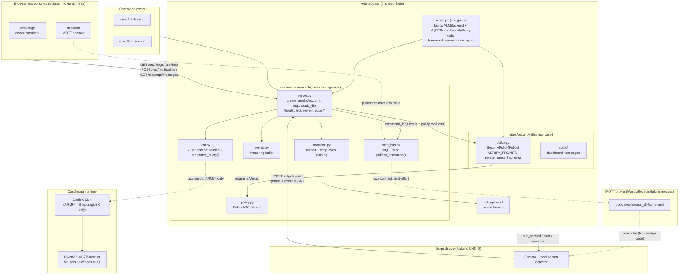

# Qonclave Hub

HTTP server for the Snapdragon laptop hub. The hub is split into a reusable
**framework** (transport, event store, VLM primitive, HTTP routes) and a thin
**app** on top that declares one use case's model prompt, verification
schema, and alert text — matching the framework/application split in
`qonclave_proposal.md` §4.3.

## Design

### Architecture



On non-Snapdragon machines the `geniex` import inside `framework/vlm.py` is
never attempted at module load — only when a request actually needs
reasoning, and only if the host is ARM64. Everything else in the diagram
(routes, event store, uploads, dashboard) runs identically on any OS.

### Framework vs. app

- **`framework/`** is reusable across use cases: it knows how to accept a
  frame + edge event over HTTP, run VLM inference, keep a ring buffer of
  recent events for a dashboard, and serve an app's static test pages. It
  has no idea what "person_present" or "fall_detected" means.
- **`apps/security/`** declares everything specific to stationary
  person-detection: the verification prompt (`VERIFY_PROMPT`), the JSON
  schema it expects back from the VLM, how that maps to an alert string, and
  the `identity_status` stretch-goal stub. A new use case (fall detection,
  hazard detection, ...) means writing a new `Policy` subclass in a new
  `apps/<name>/` package — no framework code changes.
- **`hub/server.py`** is the entrypoint: it picks one app (today,
  `SecurityPolicy`) and wires it into `framework.server.create_app()`. To
  demo a different app, swap what this file constructs.

The `Policy` contract (`framework/policy.py`):

```python
class Policy(ABC):
    name: str
    def evaluate(self, image_path: str, event: dict) -> Verdict: ...
    def command_for(self, verdict: Verdict, event: dict) -> dict | None:
        return None   # override to route a hub->edge command
```

`Verdict` carries `verified`, `confidence`, `alert`, reasoning text/latency,
and an `extra` dict for any app-specific wire fields (e.g.
`identity_status`) that get merged flat into the response.

### Request flow: `POST /edge/event`

```mermaid
sequenceDiagram
    participant Edge as Edge device
    participant Server as framework/server.py
    participant Transport as framework/transport.py
    participant Policy as apps/security/policy.py
    participant VLM as framework/vlm.py
    participant Model as GenieX / Qwen2.5-VL
    participant MQTT as framework/mqtt_bus.py

    Edge->>Server: POST /edge/event (frame + event JSON)
    Server->>Transport: parse_edge_event()
    Server->>Transport: save_incoming_image()
    Transport-->>Server: saved frame path

    Server->>Policy: evaluate(path, event)
    Policy->>VLM: structured_query(path, VERIFY_PROMPT, json_mode=True)
    alt VLM available (ARM64 + GenieX loaded)
        VLM->>Model: reset(), then generate() with json_mode=True, temperature=0.1
        Model-->>VLM: JSON text - person_present, confidence, description
        VLM-->>Policy: parsed dict
        Policy-->>Server: Verdict(verified, confidence, alert, ...)
    else VLM unavailable (non-ARM64 or geniex missing)
        VLM-->>Policy: available=false
        Policy-->>Server: Verdict(verified=false, alert="unverified...")
    end

    Server->>Policy: command_for(verdict, event)
    opt command is not None
        Server->>MQTT: publish_command(device_id, command)
        Note over MQTT: qonclave/<device_id>/command\n(best-effort; no-op if no broker)
    end
    Server->>Server: build response envelope (hub_verified, hub_confidence, command, ...)
    Server->>Server: events.record_event() into ring buffer plus latest frame
    Server-->>Edge: schema_version, event_id, received, hub_verified, hub_confidence, identity_status, command, alert

    Note over Server,Edge: The dashboard (/user/events, /user/latest.jpg) polls the same event store just updated.
    Note over MQTT,Edge: A subscribed edge device also receives the same command over MQTT,\nindependent of this HTTP response - useful if it wasn't the one that opened this request.
```

`POST /user/reason` follows the same save-image -> VLM step, but calls the
generic `VLMBackend.reason()` method directly (bypassing any Policy) and
returns raw text instead of a structured verdict, and does **not** call
`events.record_event()` — so it never appears on the dashboard. That split is
deliberate: `/user/reason` is a framework-level reasoning-only developer
tool; `/edge/event` is the real device contract, driven by whichever app is
wired into the entrypoint.

## Endpoints

All routes are generic (`framework/server.py`); only the app's `Policy` and
static test pages vary per use case.

| Method | Path | Purpose |
|--------|------|---------|
| GET | `/health` | Liveness + VLM availability + MQTT status + active app name |
| GET | `/` | Redirects to `/user/dashboard` |
| GET | `/test/edge` | Edge-device simulator page (standalone; not linked from `/user/*`) |
| GET | `/test/hub` | Hub-side MQTT console: publish/observe any topic (links only to `/test/edge`) |
| POST | `/test/mqtt/publish` | Generic MQTT publish proxy: `{"topic": "...", "payload": {...}}` |
| GET | `/test/mqtt/messages` | Recently received MQTT messages, optionally filtered by `?topic=` |
| POST | `/edge/event` | Edge event JSON + frame in, policy-driven verification response out |
| GET | `/user/dashboard` | Live event / verification dashboard page (also the default `/user/` landing) |
| GET | `/user/events` | Recent events + results (JSON) |
| GET | `/user/latest.jpg` | Most recent frame |
| GET | `/user/frames/<name>` | A specific stored frame |
| POST | `/user/reason` | Raw VLM tester: image in, reasoning text out |
| GET | `/user/test_reason` | Reason tester page (posts to `/user/reason`) |

### File layout

```
hub/
  server.py                # entrypoint: picks an app, runs framework.server.create_app()
  requirements.txt
  framework/                # reusable, use-case agnostic
    server.py               # create_app(policy, vlm, mqtt, static_dir) -> Flask
    transport.py            # upload handling + edge-event parsing
    events.py               # event ring buffer for the dashboard
    vlm.py                  # VLMBackend: reason() + structured_query()
    mqtt_bus.py              # MQTTBus: publish_command() hub->edge push channel
    policy.py               # Policy ABC + Verdict dataclass (the app contract)
  apps/
    security/                # this use case: stationary person detection
      policy.py              # SecurityPolicy(Policy)
      static/                # test_reason.html, dashboard.html, test_edge.html, test_hub.html
      samples/                # bundled test images + helpers
```

### Operator app vs. test consoles

`hub/apps/security/static/` ships four pages, deliberately split into two
groups with **no hyperlinks between the groups**:

- **Operator app** (`dashboard.html`, `test_reason.html`) — nav bar links
  the two to each other. `/` and `/user/` both land on the dashboard.
  - **`/user/dashboard`** — the live event/verification dashboard.
  - **`/user/test_reason`** — posts to `/user/reason`; shows raw VLM
    reasoning. Does **not** record to the dashboard.
- **Test consoles** (`test_edge.html`, `test_hub.html`, served at
  **`/test/edge`** and **`/test/hub`**) — nav bar links the two to each
  other, but neither links to or from the operator pages. Visually distinct
  (amber/monospace theme vs. the operator app's blue theme) so they're never
  mistaken for part of the app:
  - **`/test/edge`** — stands in for an Arduino UNO Q: posts a frame + edge
    metadata (`device_id`, `event_id`, `edge_confidence`) to `/edge/event`,
    the same contract a real device uses (**records to the dashboard**),
    plus an MQTT publish/receive panel at the bottom (defaults: publish to
    `qonclave/unoq-01/status`, receive `qonclave/unoq-01/command` — what a
    real device would subscribe to).
  - **`/test/hub`** — a browser stand-in for `mosquitto_pub`/`mosquitto_sub`:
    publish to and observe any MQTT topic the hub's broker carries
    (defaults: publish to `qonclave/unoq-01/command`, receive
    `qonclave/+/status` — any device's status).

### `/user/reason` vs `/edge/event`

- **`/user/reason`** is a framework-level developer tool — it returns the
  raw VLM text and timing, independent of any app's Policy.
- **`/edge/event`** is the real edge-device contract. It ingests the edge
  event metadata (`device_id`, `event_id`, `edge_confidence`, …) alongside
  the frame, runs the active app's `Policy.evaluate()`, records the result
  for the dashboard, and returns:
  ```json
  {"schema_version":"0.1","event_id":"…","received":true,
   "hub_verified":true,"hub_confidence":0.91,
   "identity_status":"not_enabled","command":null,
   "alert":"Person verified near camera"}
  ```
  `command` is populated by `Policy.command_for()` when an app wants to send
  something back to the edge device (e.g. `{"type":"navigate_to", ...}`);
  it's `null` for apps with no edge actuator to command, like `security`.

## Runs anywhere; reasoning only on Snapdragon

The server itself runs on **any** laptop (regular x86 Windows/Linux included).
The heavy reasoning uses **GenieX + Qwen2.5-VL-7B**, which is Snapdragon-X-only,
so `geniex` is imported **conditionally at runtime** — never at module load.

- On a Snapdragon X laptop with GenieX installed → reasoning returns real VLM output.
- On any other machine → the server, upload, logging, dashboard, and test page
  all work; reasoning returns `{"available": false, ...}` so you can test the
  plumbing end to end.

## Run

```bash
pip install -r hub/requirements.txt
python hub/server.py                       # http://0.0.0.0:8000
```

By default, per-request access logs are **hidden** (the dashboard polls every
2s and would flood the console); the hub's own event/alert logs still show. To
see per-request logs:

```bash
python hub/server.py --verbose             # show werkzeug access logs
python hub/server.py --host 0.0.0.0 --port 8000 -v
```

Then open <http://localhost:8000/> for the operator dashboard, or
<http://localhost:8000/test/edge> to simulate an edge device posting to
`/edge/event` (and linked from there, <http://localhost:8000/test/hub> for
the MQTT console).

Environment options:

| Var | Default | Meaning |
|-----|---------|---------|
| `QONCLAVE_HOST` | `0.0.0.0` | Bind address |
| `QONCLAVE_PORT` | `8000` | Port |
| `QONCLAVE_WARMUP` | – | Set `1` to load the VLM model at startup |
| `QONCLAVE_MAX_UPLOAD_MB` | `16` | Max upload size |
| `QONCLAVE_EVENTS_MAX` | `50` | Dashboard event ring-buffer size |
| `QONCLAVE_MQTT_HOST` | `127.0.0.1` | MQTT broker address |
| `QONCLAVE_MQTT_PORT` | `1883` | MQTT broker port |
| `QONCLAVE_MQTT_ENABLED` | `1` | Set `0` to skip MQTT entirely (HTTP-only mode) |

## Calling `/user/reason`

**Browser / curl (multipart):**
```bash
curl -F "image=@frame.jpg" -F "prompt=Is there a person?" http://HUB_IP:8000/user/reason
```

## Calling `/edge/event` (edge device)

**curl (multipart form + event JSON):**
```bash
curl -F "image=@frame.jpg" \
     -F 'event={"device_id":"unoq-01","event_id":"evt-123","edge_confidence":0.82}' \
     http://HUB_IP:8000/edge/event
```

**Arduino UNO Q (raw bytes — simplest for a constrained device):**
POST the JPEG bytes directly with an image content type. Edge metadata goes in
the query string; optional prompt via the `X-Prompt` header.
```
POST /edge/event?device_id=unoq-01&event_id=evt-123&edge_confidence=0.82 HTTP/1.1
Host: HUB_IP:8000
Content-Type: image/jpeg
Content-Length: <n>

<...raw jpeg bytes...>
```

Both shapes return the schema-compliant verification response shown above.

## Dashboard

Open <http://HUB_IP:8000/user/dashboard>. It polls `/user/events` every 2s and
shows the latest escalation frame, hub verification, edge/hub confidence, alert
state, and a table of recent events.

## MQTT broker (hub->edge push channel)

`/edge/event`'s `command` field only reaches a device if it has an HTTP
request open at that moment. `framework/mqtt_bus.py` gives the hub a second,
independent path to push the same command: whenever a `Policy.command_for()`
returns non-`None`, the hub also publishes it to
`qonclave/<device_id>/command` on an MQTT broker, so a device that's simply
subscribed (not mid-request) still receives it.

- **Broker**: Eclipse Mosquitto, run as its own process — decoupled from
  `hub/server.py`'s lifecycle. Start it once; restart the hub as often as you
  like without losing the broker or its subscribers.
  ```powershell
  powershell -ExecutionPolicy Bypass -File .\scripts\setup_mqtt.ps1
  # or, if already installed:
  mosquitto -c scripts\mosquitto.conf -v
  ```
- **Topics**:
  - `qonclave/<device_id>/command` — hub → edge (JSON, from `command_for()`)
  - `qonclave/<device_id>/status` — reserved for a future edge → hub leg; not consumed yet
- **Client**: `hub/framework/mqtt_bus.py`'s `MQTTBus`, using `paho-mqtt`.
  Same "runs anywhere" philosophy as `VLMBackend`: the broker connection is
  lazy and best-effort — if no broker is reachable, `/edge/event` still
  returns 200 with the same schema; the MQTT publish is just skipped and
  logged.
- **`/health`** reports broker connectivity alongside VLM status:
  ```json
  {"vlm": {...}, "mqtt": {"available": true, "host": "127.0.0.1", "port": 1883, ...}}
  ```
- **`apps/security`** has no edge actuator to command, so
  `SecurityPolicy.command_for()` stays the framework default (`None`) — MQTT
  publishing is dormant for this app and only activates once a `Policy`
  overrides `command_for()`.
- Anonymous auth, loopback-only, no persistence — fine for a local hackathon
  demo on a private WiFi network. **Not** safe for production or any
  internet-facing deployment as configured.
- **Browser test consoles**: `/test/hub` and the bottom of `/test/edge` give
  a no-CLI way to exercise this — publish to and observe any topic via
  `POST /test/mqtt/publish` / `GET /test/mqtt/messages`, which proxy through
  the hub's shared `MQTTBus` (browsers can't open a raw MQTT-over-TCP
  socket directly). See "Operator app vs. test consoles" above.

## Sample images

`hub/apps/security/samples/` ships ready-to-use test images (a person scene,
an empty scene, and Qualcomm's GenieX demo photo) plus helpers. See
`hub/apps/security/samples/README.md`. Quick test against a running hub:
```bash
python hub/apps/security/samples/send_sample.py room_with_person   # -> /edge/event
```

## Building a new app

1. Create `hub/apps/<name>/policy.py` with a class that subclasses
   `framework.policy.Policy` and implements `evaluate(image_path, event) ->
   Verdict`. Override `command_for()` if the use case needs to send a
   command back to the edge device.
2. Add `hub/apps/<name>/static/` with `test_reason.html`, `dashboard.html`
   (copy from `apps/security/static/` and adjust labels — the JSON shape
   they poll is generic). `test_edge.html`/`test_hub.html` are optional to
   copy too if the new app wants its own device-simulator/MQTT-console pages.
3. In `hub/server.py`, swap the `SecurityPolicy(vlm)` construction and
   `STATIC_DIR` for the new app.

No changes to `framework/` are needed for a new use case.
